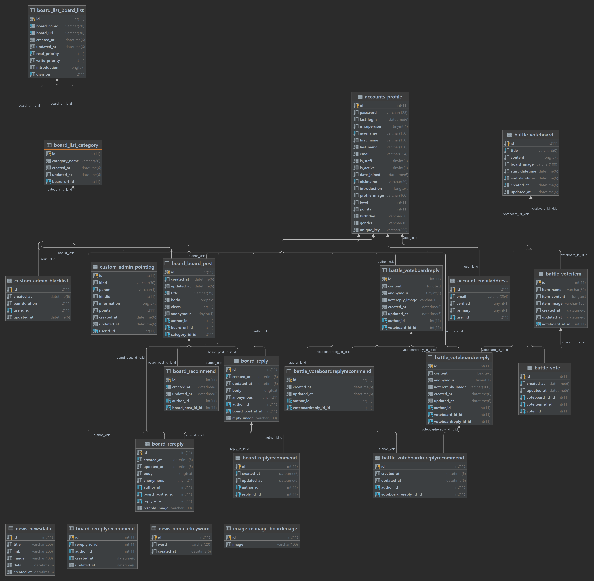

# DALGONA

## 프로젝트 개요

---

엔터테인먼트 플랫폼 사이트

## 프로젝트 설명

---

- 커뮤니티 사이트

## 서비스 주소

---

###  Backend Link

https://dalgonabackend.shop/

## Project Duration

---

2021-08-21 ~

## 기술 스택 (Backend Stack)

---

###- Language


###- Frameworks

 

###- Database


## 배포 툴

---

#### Backend


## 팀 정보 및 역할

---

### [Backend Developer]

##### 🧑 이창우 Team Sub Leader :

어느 파트 무엇을 했는지

- Github : https://github.com/su100

##### 🧑 최예준 :

어느 파트 무엇을 했는지

- Github : https://github.com/Yejun4911

##### 👩 권민채 :

어느 파트 무엇을 했는지

- Github : https://github.com/MinchaeGwon

##### 👩 채예진 :

어느 파트 무엇을 했는지

- Github : https://github.com/yejin013

## 프로젝트 구조

---

```
Project Root
├── 📂 dalgona(config)
│    ├── 📑 asgi.py
│    ├── 📑 asset_storage.py                          # AWS Bucket Setting (Not Using)
│    ├── 📑 middleware.py                             # Add Cookies Setting
│    ├── 📑 settings.py                               # Django Settings
│    ├── 📑 urls.py                                   # Main Url Endpoint
│    └── 📑 wsgi.py                                   # WSGI Setting
│
├── 📂 app(accounts)
│    ├── 📂 serializers                               # 기능별 Serializer 정리
│    │    ├── 📑 기능별_serializers.py                 
│    │    └── 📑 기능별_serializers.py
│    ├── 📂 views                                     # 기능별 views 정리
│    │    ├── 📑 기능별_views.py                       
│    │    └── 📑 기능별_views.py
│    │
│    ├── 📑 adapter.py                                # Account Adapter
│    ├── 📑 admin.py                                  # Django Admin Setting
│    ├── 📑 apps.py
│    ├── 📑 raw_sqls.py                               # SQL Functions
│    ├── 📑 tests.py                                  # Test Case (Not used)
│    ├── 📑 urls.py                                   # Url Endpoint
│    └── 📑 models.py                                 # Object Setting
│
├── 📂 app
│    ├── 📂 serializers                               # 기능별 Serializer 정리
│    │    ├── 📑 기능별_serializers.py                 
│    │    └── 📑 기능별_serializers.py
│    ├── 📂 views                                     # 기능별 views 정리
│    │    ├── 📑 기능별_views.py                       
│    │    └── 📑 기능별_views.py
│    │
│    ├── 📑 admin.py
│    ├── 📑 apps.py
│    ├── 📑 raw_sqls.py
│    ├── 📑 tests.py
│    ├── 📑 urls.py
│    └── 📑 models.py
│
├── 📦 requirements.txt                               # Dependancy 
├── 📑 manage.py                                      # Django Start Point
├── 🗑 .gitignore                                      # gitignore
└── 📋 README.md                                      # README
```

---

## 추가 정보

### [프론트엔드 설명 주소]

https://github.com/su100/dalgona-community

### [API Request Postman]

account_api : 

battle_api :

board_api :

board_list_api :

common_api :

image_upload_api :

news_api :


### [Database Structure]


